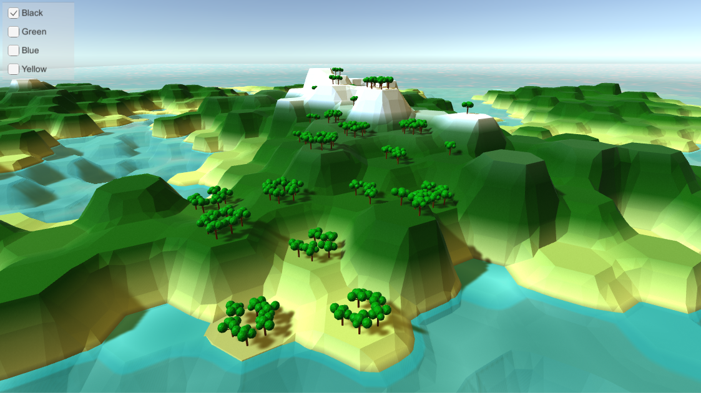
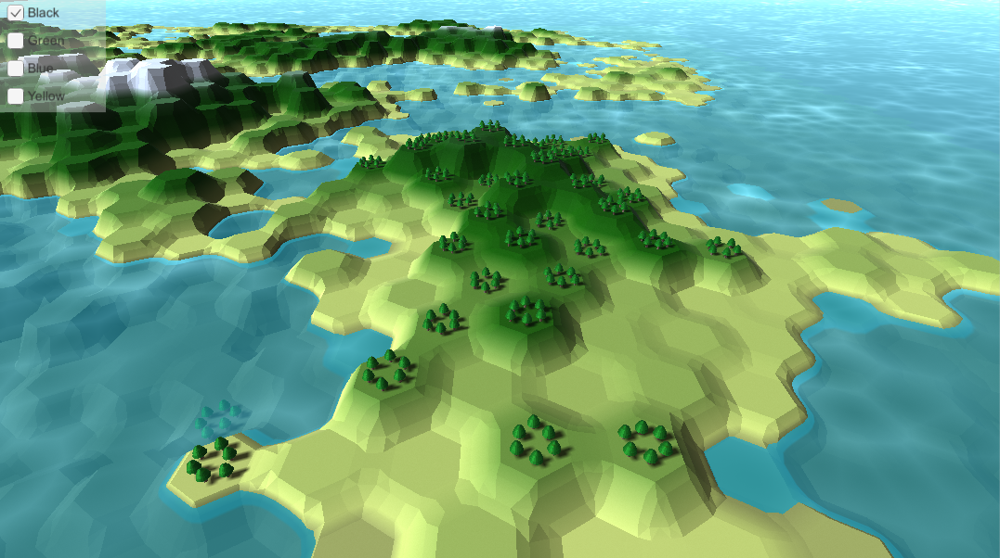
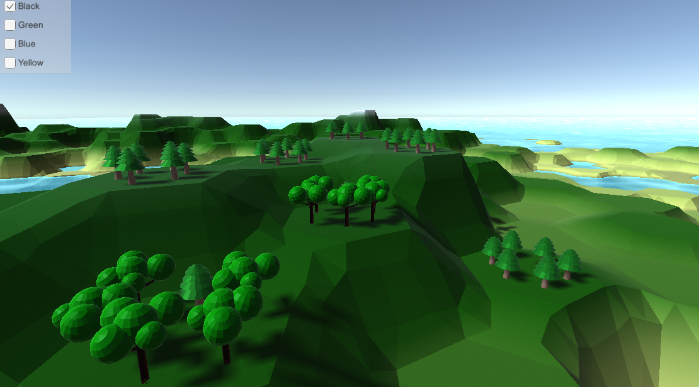
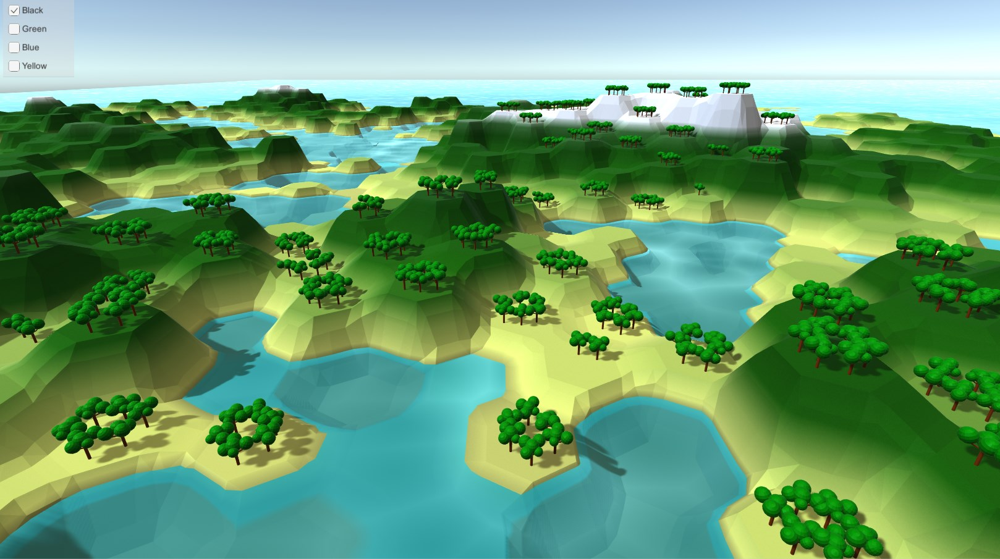
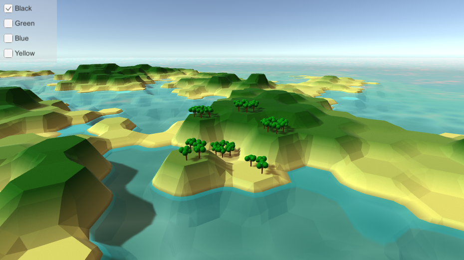
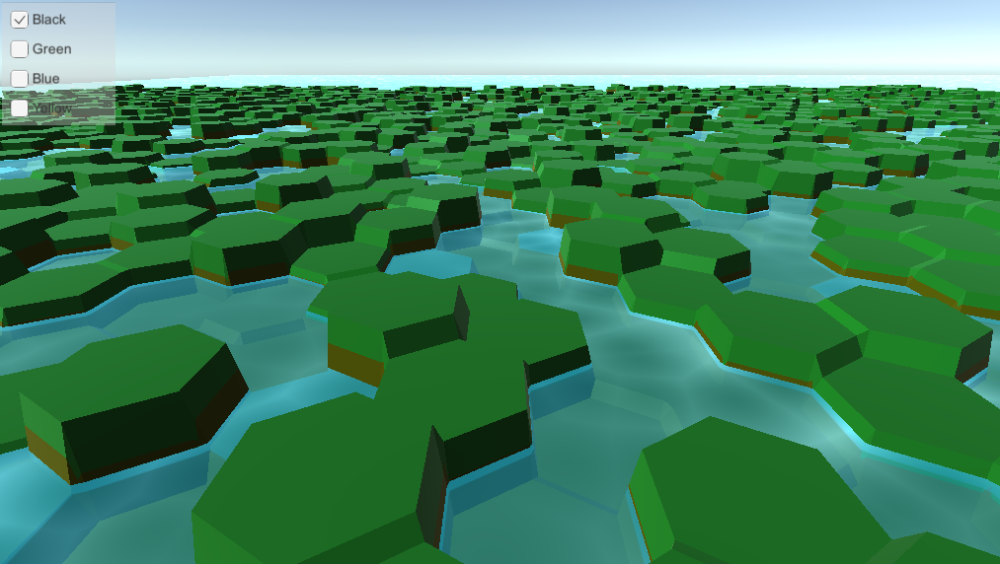

# simple_hex_game
A simple hex map, partially based on the [Catlike Coding hex map tutorial series](https://catlikecoding.com/unity/tutorials/hex-map/).

The primary goal of this project was to learn how to create procedural meshes in Unity. I now feel quite comfortable with procedural mesh generation, and have moved on to other projects. However, I may revisit this eventually to add some kind of gameplay, or possibly a more in-depth world editor.

